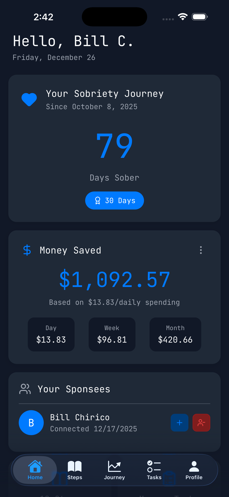
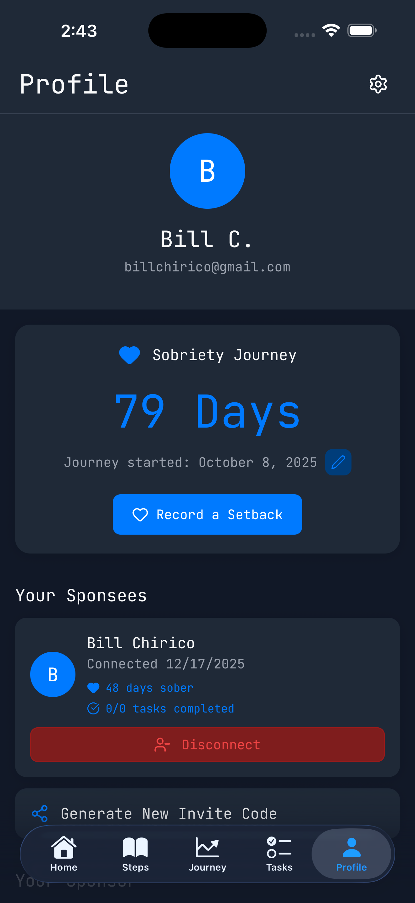

# Sobers

[](https://github.com/VolvoxCommunity/sobers/actions/workflows/ci.yml)
[](https://codecov.io/gh/VolvoxCommunity/sobers)

A cross-platform recovery companion app connecting sponsors and sponsees through task management, milestone tracking, and progress visualization. _Think Jira for your sobriety._

<p align="center">
  
  
  
  
</p>

## Features

- **Dual roles** - Be both sponsor and sponsee simultaneously
- **Task management** - Assign and track step-aligned recovery work
- **Sobriety tracking** - Day counters, milestones, savings calculator
- **12-step content** - Full program with reflection prompts
- **Privacy-first** - Row-level security for all data
- **Cross-platform** - iOS, Android, and web

## Tech Stack

| Layer     | Tech                                         |
| --------- | -------------------------------------------- |
| Framework | Expo 54, React Native 0.81, React 19         |
| Routing   | Expo Router v6 (file-based, typed routes)    |
| Backend   | Supabase (Postgres + Row Level Security)     |
| Auth      | Email/password, Google OAuth, Apple Sign-In  |
| Language  | TypeScript 5.9 (strict mode)                 |
| Testing   | Jest 29, Playwright (E2E)                    |
| Tooling   | pnpm, ESLint 9, Prettier, Husky, lint-staged |

## Quick Start

```bash
# Install
git clone <repository-url> && cd Sobers && pnpm install

# Configure .env
EXPO_PUBLIC_SUPABASE_URL=<your-url>
EXPO_PUBLIC_SUPABASE_PUBLISHABLE_KEY=<your-key>

# Run
pnpm web      # Web
pnpm ios      # iOS Simulator
pnpm android  # Android
```

## Commands

| Command            | Description                   |
| ------------------ | ----------------------------- |
| `pnpm dev`         | Start Expo + Supabase         |
| `pnpm web`         | Start web dev server          |
| `pnpm ios`         | Run on iOS Simulator          |
| `pnpm android`     | Run on Android                |
| `pnpm test`        | Run Jest tests (80% coverage) |
| `pnpm test:e2e`    | Run Playwright E2E tests      |
| `pnpm typecheck`   | TypeScript type checking      |
| `pnpm lint`        | ESLint                        |
| `pnpm format`      | Prettier formatting           |
| `pnpm build:web`   | Build static web export       |
| `pnpm start:clean` | Clear Metro cache and restart |

## Project Structure

```
app/                      # Expo Router screens
├── _layout.tsx           # Root layout with auth guards
├── login.tsx             # Login screen
├── signup.tsx            # Sign up screen
├── onboarding.tsx        # New user onboarding
└── (app)/                # Authenticated group
    └── (tabs)/           # Tab navigation
        ├── index.tsx     # Dashboard (home)
        ├── tasks.tsx     # Task management
        ├── journey.tsx   # Recovery timeline
        ├── profile.tsx   # User profile
        └── steps/        # 12-step content
components/               # Reusable UI components
contexts/                 # AuthContext, ThemeContext
hooks/                    # Custom React hooks
lib/                      # Utilities (supabase, logger, etc.)
types/                    # TypeScript types
supabase/                 # Database migrations
e2e/                      # Playwright E2E tests
__tests__/                # Jest unit tests
```

## Auth Flow

```
login/signup → onboarding (first-time setup) → (tabs) main app
```

Deep link scheme: `sobers://`

## CI/CD

- **GitHub Actions**: lint → typecheck → build → test (80% coverage gate)
- **EAS Build**: `development`, `preview`, `production` profiles
- **Automated PR reviews** via Claude Code

## Documentation

| Doc                                                        | Description                         |
| ---------------------------------------------------------- | ----------------------------------- |
| [`CLAUDE.md`](CLAUDE.md)                                   | Development workflow & architecture |
| [`docs/GOOGLE_OAUTH_SETUP.md`](docs/GOOGLE_OAUTH_SETUP.md) | Google OAuth configuration          |
| [`docs/APPLE_SIGNIN_SETUP.md`](docs/APPLE_SIGNIN_SETUP.md) | Apple Sign-In configuration         |
| [`docs/logger.md`](docs/logger.md)                         | Logging API reference               |

## License

Private and confidential. All rights reserved.
